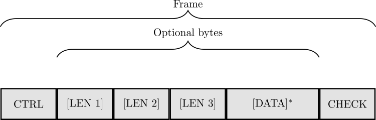

# Development information and contributing

This documentation file is intended to summarize and share the necessary information about the project organization and code structure in order to ease contributions.

## Communication protocol used across bridge device and fuzzer

On the top of the computer-to-bridge serial link a communication protocol is implemented.
It is block-oriented and enables you either to send commands to the bridge or to send data to be redirected to the smartcard. 
The computer and the bridge are exchanging sequences of bytes grouped into block structures as depicted right bellow :





First byte of a block is called the control byte (CTRL).
It indicates the "type" of the current block. Currently supported types are :
* *DATA BLOCK* : such a block encapsulates bytes of data to be repeated from the computer to the smartcard (or from the smartcard to the computer). It is intended to carry data from the computer at destination of the smartcard (or from the smartcard to the computer). It typically carries the fuzzer payload (test-case) to be applied to the card (and the card response to be checked out by fuzzer's oracle).
* *ACK BLOCK* : it carries an acknowledgment information. Each block (except the ACK BLOCK itself) has to be acknowledged after its correct reception by such a block. These blocks are not re-transmitted to the smartcard. It is aimed to control the computer-to-bridge communication flow.
* *NACK_BLOCK* : carries a non-acknowledgment information.
* *COLD RESET BLOCK* : is used by the computer/fuzzer in order to ask the bridge to perform a cold reset procedure on the smartcard (see ISO/IEC7816-3 section 6.2.2). It is very useful for the fuzzer to be able to reset the card and thus to put it in a well-known state after each test-case.

Then, the control-byte is followed by three optional LEN bytes encoding the size (in number of bytes) of the eventual data payload (DATA field).
Most significant bits are in the LEN1 field and least significant ones are located in the LEN3 field.
As long as only the data blocks contain a data-field, the LENx bytes are only present in the case of a data block.

The block structure ends with an LRC byte containing an LRC checksum of all the previous bytes of the block.

The bridge's firmware is designed to be fully asynchronous and full-duplex.
For more details about the state machine ruling this protocol you can have a look to the [related master-thesis](https://www.bouffard.info/assets/pdf/reports/SIMUNOVIC_report_2020.pdf).

## File hierarchy in the project

* *./src* contains .c source files.
* *./inc* contains all the header files.
* *./lib* contains STMicoelectronics HAL and CMSIS libraries and instructions to compile them.
* *./startup* contains target specific initialization sources files.
* *./ld* contains target specific linker scripts.
* *./openocd* contains target specific configuration files for the openocd tool.
* *./iso7816-reader* is a git submodule containing the ISO7816-3 stack implementation. 
* *./CMock* and *./Unity* are git submodules containing the code unit testing and mocking framework.
* *./tests* contains the unit testing code and procedures.
* *./images* contains illustrations for the README documentation files

## Testing the code

The bridge state machine has to pass the test routines located in the *./tests* directory.
Tests are compiled and run on the local development machine.
For detailed information, see README in the *./tests* directory.

To run the tests, make sure you have the following tools installed on your local machine :
* gcc
* lcov
* ruby (CMock framework needs it for the scripts which are building mock's code)
* libc of the arm cross-compiler ?
``` shell
$ dnf install arm-none-eabi-newlib.noarch
```
* genhtml

Set up the following parameters in the Makefile_tests file to its correct values (accordingly to your current setup) :

``` shell
CC=gcc
LD=gcc
RUBY=ruby
LCOV=lcov
GCOV=gcov
GENHTML=genhtml
```

Finally, you can compile all the test executables by doing the following from the main project directory :
``` shell
$ make tests
```
then, you execute them by typing :
``` shell
$ make test
```

You can obtain a code coverage report by using the following make instruction :
``` shell
$ make report
```
A report in an HTML format is then available in the *tests/cov* directory.
Note that the tests have to be run before building the coverage report.


note : for the tests the specified gcc and gcov versions are gcc-7 and gcov-7. Seems to be compatibility problems with gcc-9 and gcov-9. Still needs to be tested for gcc-8 and gcov-8.

## On-target debugging

You need to install *openocd* tool on your local machine, then run the following bash script (in project's main directory) to run the openocd server.

``` shell
$ sudo apt-get install openocd
$ ./start_openocd.sh <target>
```

*target* is a value depending on the target you are debugging.
Possible values are :

*stm32f411
*stm32f407

To manage the openocd server :
``` shell
$ telnet localhost 4444
```

Basic commands : shutdown.
For more commands see : http://openocd.org/doc/html/General-Commands.html

Debugger :

``` shell
$ sudo apt-get install gdb-multiarch
```
(or arm-none-eabi-gdb)


run :
``` shell
$ gdb-multiarch out/test.elf
gdb> target remote localhost:3333
gdb> monitor reset halt
```

## Brief description of the main functions and code organization

The code of the bridge is mainly composed of three parts :
* The state machine handling the serial communication with the fuzzer on the computer (code in *state_machine.c/h*).
* The reader code handling the interactions between the bridge and the smartcard (*iso7816-reader* submodule).
* The bridge's code itself coordinating the two previous parts for the bridge to behave as a bridge (code in *bridge_advanced.c/h*).

The bridge implementer for a specific target shall only make use of the bridge public functions (*bridge_advanced.c/h*).

The code of the bridge is organized in a way to clearly separate hardware dependent code and the algorithmic aspects of the state machine.  
For example, when the protocol state machine needs to perform an action on the underlying hardware, it is implemented as a callback function which needs to be re-written by the bridge implementer and filled with the code corresponding to its target.
Those functions are the following (a precise documentation of those functions can be found in the source code in the *src/bridge_advanced.c* file) :

``` C
/* This function is designed to be typically called from a timer interrupt routine */
BRIDGE2_Status BRIDGE2_ProcessTimerInterrupt(void);
/* Timer peripheral interrupt management */
BRIDGE2_Status BRIDGE2_EnableTimerInterrupt_Callback(void);
BRIDGE2_Status BRIDGE2_DisableTimerInterrupt_Callback(void);

/* This function is designed to be typically called from an interruption routine when UART peripheral is ready to transmit a byte */
BRIDGE2_Status BRIDGE2_ProcessTxeInterrupt(uint8_t *pByteToSend);
/* UART peripheral interruptions management */
BRIDGE2_Status BRIDGE2_EnableTxeInterrupt_Callback(void);
BRIDGE2_Status BRIDGE2_DisableTxeInterrupt_Callback(void);

/* This function is designed to be typically called from an interruption routine when UART peripheral received a byte */
BRIDGE2_Status BRIDGE2_ProcessRxneInterrupt(uint8_t rcvdByte);
/* UART peripheral interruptions management */
BRIDGE2_Status BRIDGE2_EnableRxneInterrupt_Callback(void);
BRIDGE2_Status BRIDGE2_DisableRxneInterrupt_Callback(void);
```

As the bridge is designed in an asynchronous/non-blocking way, the top level bridge's code is basically a concurrent process (implemented as a timer interrupt routine) periodically checking for new events from the computer side (protocol state machine) and applying consequently actions on the reader.


## Bridge usage / typical implementation for a specific target

1. Include bridge's header :

``` C
#include "bridge_advanced.h"
```

2. Overwriting the following (weak defined) callback functions :

``` C
BRIDGE2_Status BRIDGE2_EnableTimerInterrupt_Callback(void);
BRIDGE2_Status BRIDGE2_DisableTimerInterrupt_Callback(void);

BRIDGE2_Status BRIDGE2_EnableTxeInterrupt_Callback(void);
BRIDGE2_Status BRIDGE2_DisableTxeInterrupt_Callback(void);

BRIDGE2_Status BRIDGE2_EnableRxneInterrupt_Callback(void);
BRIDGE2_Status BRIDGE2_DisableRxneInterrupt_Callback(void);
```

3. Configure the UART peripheral (for the communication with the fuzzer) and call the following functions from the corresponding interrupt routines :

``` C
BRIDGE2_Status BRIDGE2_ProcessTxeInterrupt(uint8_t *pByteToSend);
BRIDGE2_Status BRIDGE2_ProcessRxneInterrupt(uint8_t rcvdByte);
```

4. Configure the Timer peripheral for a periodical interrupt (several milliseconds is fine) and call the following function from the interrupt routine :

``` C
BRIDGE2_Status BRIDGE2_ProcessTimerInterrupt(void);
```

5. Initialize the ISO7816 reader lib :

``` C
READER_HAL_CommSettings settings;
READER_Status readerRv;

readerRv = READER_HAL_InitWithDefaults(&settings);
if(readerRv != READER_OK) ErrorHandler();
```

6. Initialize and run the bridge and pass it reader's communication settings :

(keep in mind that bridge's implementation is asynchronous, so none of the following functions is in blocking mode)

``` C
BRIDGE2_Status rv;

rv = BRIDGE2_Init(&settings);
if(rv != BRIDGE2_OK) ErrorHandler();

rv = BRIDGE2_Run();
if(rv != BRIDGE2_OK) ErrorHandler();
```

7. Eventually stop the bridge if needed

``` C
BRIDGE2_Stop()
```

The file *main.c* contains reference implementations of the previous steps for the targets stm32f407 and stm32f411.

## Known problems, to do

* In the advanced bridge, implementing integrity check in the CHECK state.

* When the transmission state machine is bufferizing the bytes to send, it locks a mutex.
If at the same time an interruption routine tries to bufferize a byte too (for eg. sending a busy block) it may induce a deadlock.
To avoid this dead lock, the program detects and exits with error. This is very unlikely and should never happen is the computer respects the delays between requests.


* When the bridge expects an ACK from the computer :
If this ACK is not coming right after it is expected nor right after the currently being received block (ie : another kind of block is received instead), then the state machine exists on error.
A re-transmission behavior is not easy to implement because after being sent, this data is lost.


## Code conventions

* Pointers begin with lowercase 'p', for example: uint8_t *pByte
* All the functions from a same class have the same prefix in uppercase followed by an underscore.
* Private functions are following the same convention.
* All the typedefs, structs and enums have as well this prefix.
* The functions are documented in the .c files.

## Using the STM32 HAL librairy

If you need to use more modules in the stm32 hal lib you have to :
 * edit the inc/stm32f4xx_hal_conf.h file and uncomment the line corresponding to the module
 * edit the lib/Makefile file and add the corresponding line in the SRCS variable. For example : SRCS+=stm32f4xx_hal_uart.c
