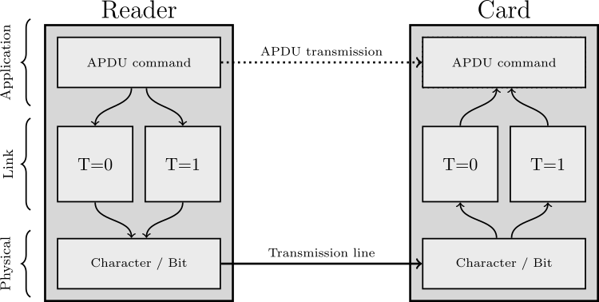
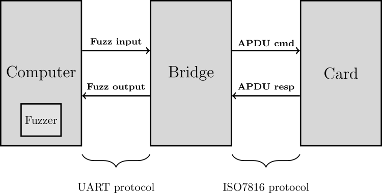

# UART driven T=1 smartcard reader

## Introduction

The software contained in this repository is a part of a master-thesis project jointly conducted by the Grenoble Institute of Technology ([Esisar](https://esisar.grenoble-inp.fr/)) and the National Cybersecurity Agency of France ([ANSSI](https://www.ssi.gouv.fr)).
This project aims at demonstrating the relevance and feasibility of a fuzzing approach in order to stress the security of ISO7816-3 communication protocol drivers implemented into smartcard devices.
For more information and details, you can have a look at the [related master-thesis](https://www.bouffard.info/assets/pdf/reports/SIMUNOVIC_report_2020.pdf).

## Description

This tool, called either "bridge" or "CardStalker", basically provides a smartcard reader at the T=1 ([see ISO7816-3](https://www.iso.org/standard/38770.html)) level (link layer), where most of the smartcard reader devices on the market are only providing an APDU (application layer) interface.
This reader is UART driven from a computer through a serial interface.
It gives you the ability to send and receive T=1 blocks.
It is composed of a development board (making the physical interface between USART and smartcard) and a software running on the top of it.
It was originally intended to work as a "bridge" between the [Boofuzz fuzzing tool](https://github.com/jtpereyda/boofuzz) and a smartcard.


## Copyright and license

Copyright ANSSI (2020-2021)

This software is free software and distributed under the terms of the GNU General Public License version 3 or any later version.

## Authors

  * Boris SIMUNOVIC (<mailto:boris.simunovic@ssi.gouv.fr>)
  * Guillaume BOUFFARD (<mailto:guillaume.bouffard@ssi.gouv.fr>)

## Some technical choices and reminders about ISO7816-3 ...

The software contained in this repository is the firmware of a "bridge", a physical device making an interface between the fuzzing algorithm running on a computer and the smartcard.

As mentioned above, the global project intends to fuzz the ISO7816-3 protocol implementation from the smartcard side.
This protocol specifies how the reader and the smartcard have to interact when using the "with contacts" electrical interface (by opposition to contact-less NFC technology).
ISO7816-3 is a part of a complete protocol stack described on the following figure. It can be interpreted as kind of a link layer and physical layer protocol.



Most of the smartcard readers that can be found on the market are designed to send and receive APDUs.
Those APDUs can be compared to an application layer data unit and thus it is not relevant to send/receive APDUs (and so to use a reader from the market) when fuzzing at the ISO7816-3 scale.
For this reason you need a custom reader hardware that enables you to interact directly with the (lower layer) the link layer.
This is bringing the need for the aforementioned "bridge" device. 
As shown on the following figure, from one side it offers a custom ISO7816-3 interface to communicate with the smartcard and from the other side it exposes a UART serial interface in order to communicate with the fuzzing tool running on the computer.
Keep in mind that this bridge tool can be used outside the fuzzing context as long as you are able to send the correct commands through the serial interface to the bridge.
If you have such a need, the communication protocol and its state-machine implemented on the top of the serial link are detailed in the related [master thesis report](https://www.bouffard.info/assets/pdf/reports/SIMUNOVIC_report_2020.pdf).



The fuzzing tool involved in the project is a fork of the open-source Boofuzz tool and is not published yet.

## Supported targets

The currently supported targets are :
* stm32f407
* stm32f411

It is recommended to use the development boards associated to those components (discovery boards).
So you won't have to change some settings in the code (especially oscillator frequency provided by the board).

If you are interested into adding a new target, your contributions are welcome, please have a look in the CONTRIBUTING.md file. 


## Connecting the bridge to the smartcard and the computer

For the currently supported targets, the wiring of the smartcard to the bridge is always the same.
From the smartcard side, the following signals have to be wired to the discovery board :

| Smartcard signal   | stm32 port   | stm32 pin number |
| ------------------ | ------------ | ---------------- |
| Clock              | PORTA        | GPIO PIN 4       |
| I/O                | PORTA        | GPIO PIN 2       |
| Power              | PORTA        | GPIO PIN 6       |
| Reset              | PORTA        | GPIO PIN 5       |
| Ground             | Ground       | Ground           |


From the computer side, you have to connect the UART interface of the bridge to your computer.
You can do so by using a very low-cost USB-to-Serial converter (like FTDI chips for example). 
On the bridge, the UART interface is exposed on the following pins :

| Bridge's UART interface          | stm32 port   | stm32 pin number |
| -------------------------------- | ------------ | ---------------- |
| TX (from bridge's point of view) | PORTB        | GPIO PIN 6       |
| RX (from bridge's point of view) | PORTA        | GPIO PIN 10      |
| Ground                           | Ground       | Ground           |

## Getting and setting-up the project on your local machine

First, clone the project repository and all its submodules.
``` shell
$ git clone https://github.com/ANSSI-FR/cardstalker.git
$ git submodule update --init --recursive
```
The project is relying on the following submodules : 
* *iso7816-reader*, this library contains all the necessary features for the bridge to interact with the smartcard.
* *Unity*, is a unit-test framework for testing the project, especially for testing the protocol state machine for interacting with the fuzzer.
* *CMock*, is a mocking framework used jointly with the unity framework. Useful for testing parts of code relying on hardware functions.

## Building the project

### Installing toolchain and dependencies

You have to install the ARM toolchain and cross-compiler on your local machine.
Typically can be achieved by doing :
``` shell
$ apt-get install arm-none-eabi-*
```
You need as well to install the ST toolchain for flashing the target (stlink), especially the *st-flash* executable.
You can get it from the [git repository](https://github.com/stlink-org/stlink), or on debian-like distributions you can do :

``` shell
$ apt-get install stlink-tools
```

### Setting-up the Makefile

1. In the Makefile in the main directory you need to set the following parameters to their correct values :

``` shell
CC=arm-none-eabi-gcc
LD=arm-none-eabi-gcc
AR=arm-none-eabi-ar
OBJCOPY=arm-none-eabi-objcopy
STFLASH=st-flash
```

2. Then, do the same for the Makefile in the *./lib* directory :

``` shell
CC=arm-none-eabi-gcc
AR=arm-none-eabi-ar
OBJCOPY=arm-none-eabi-objcopy
STFLASH=st-flash
```

3. Repeat steps 1. and 2. in the *iso7816-reader* submodule.


NOTE: if you have several ARM cross-compilers installed on your local machine (typically if you have a concurrent Xilinx toolchain)
it is recommended to explicitly indicate the absolute path to the correct compiler to avoid problems.

### Selecting the target

To select the target for which the firmware has to be compiled you have to follow those steps :

1. In the main directory open the Makefile and uncomment the line corresponding to your target :

``` shell
# Target can be stm32f407, stm32f411.
#TARGET=stm32f411
#TARGET=stm32f407
```

2. In the ./lib directory open the Makefile and uncomment the line corresponding to your target :

``` shell
# Target can be stm32f407, stm32f411.
#TARGET=stm32f411
#TARGET=stm32f407
```

3. Do again the steps 1. and 2. in the iso7816-reader submodule. 

### Compiling and uploading the project to the target

Use the following commands from the main directory to compile the project and upload it to the target.

``` shell
$ make all
$ make upload
```

## Contributing

Pull requests are welcome. See `CONTRIBUTING.md`.


## Community

If you’ve found a bug, or have an idea/suggestion/request, fill an issue
here on GitHub or contact the authors by email.
